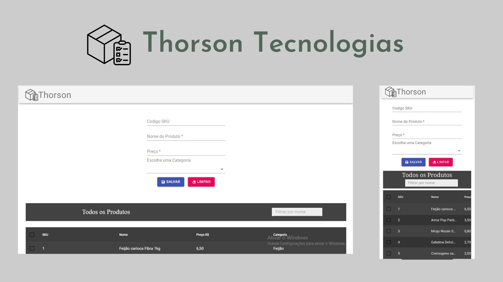

   <h1 style="text-align: center; display: flex; flex-direction: row; align-items: center;">
      
      Thorson Tecnologia 
   </h1>
   

      Um simples CRUD para produtos, feito durante o processo Seletivo da empresa Thorson Tecnologia.
   

   
   <h3>🚀 Tecnologias Usadas</h3>
   <ul>
      <li>React</li>
      <li>typeScript</li>
      <li>Material-UI</li>
      <li>React-data-table-component</li>
      <li>React-Hook-Form</li>
      <li>JSON-SERVER</li>
      <li>Sweet Alert</li>
   </ul>
   <h3>📓 Como usar no seu PC</h3>
   <ul>
      <li>Antes é preciso ter instalado o <a href="https://nodejs.org/en/">NodeJS</a></li>
      <li><code>git clone https://github.com/franwanderley/Thorson_entrevista</code></li>
      <li><code>cd 'sua pasta'</code></li>
      <li><code>code .</code> para abrir no VSCode</li>
      <li><code>npm install</code></li>
      <li>Depois da Instalação roda  <code>npm start</code></li>
      <li>Depois disso acesse http://localhost:3000</li>
      <li>Ou você pode apenas acessar-lo <a href="https://thorson-entrevista.vercel.app/">neste link</a></li>
   </ul>
   <h3>Funcionalidades</h3>
      <ol>
         <li>Criar Produtos, basta voçê preencher o formulario</li>
         <li>Modal de FeedBacks de Erros</li>
         <li>Validação de SKU duplicata</li>
         <li>Validação complexas de dados</li>
         <li>Ver os produtos na tabela</li>
         <li>Ver um produto no modal</li>
         <li>Editar Produto</li>
         <li>Deletar Produtos</li>
         <li>Modal de Confirmação ao deletar</li>
         <li>Filtrar por nome os Produtos</li>
         <li>Ordenar por nome, preço e categoria os Produtos</li>
      </ol>
   <h3>👍 Como ajudar</h3>
   <ul>
      <li>Faça um fork do projeto.</li>
      <li>Crie uma nova branch com as suas alterações: git checkout -b my-feature</li>
      <li>Salve as alterações e crie uma mensagem de commit contando o que você fez: git commit -m "feature: My new feature"</li>
      <li>Envie as suas alterações: git push origin my-feature</li>
   </ul>